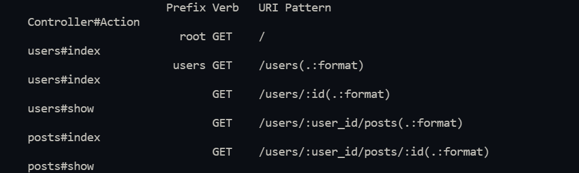

# Blog app

> In this project, I created all controllers and views for my Blog app and added simple placeholders for my views with plain HTML.

## Screenshot



## The learning objective of this project are

- Use controllers to handle requests and render empty views.
- Install Ruby on Rails framework.
- Use Ruby Gems as a software packages system.
- Understand Rails naming conventions.
- Use params from browser requests in a safe way.


## Built With

- Ruby
- Rails
- Postgresql
- Rubocop

## Getting Started

To get a local copy up and running follow these simple example steps.

### Prerequisites

- [Ruby on Rails](https://guides.rubyonrails.org/getting_started.html)

### Setup
- ```git clone https://github.com/julie-ify/Blog-app.git```

- ```cd Blog-app```

### Running The App

- Run ```bundle install``` to install all the necessary gems
- Run ```rake db:create:all``` and ```rake db:migrate``` then run ```rails s``` 
- Go to the browser and type `localhost:3000` to see the app

### Test

- Run ```gem install rspec``` to install Rspec,

- Run ```rspec spec``` to run all the test cases, and

- Run ```rspec spec/name_of_test_file.rb``` to run test cases individually.

## Author

👤 **Juliana Ifionu**

- GitHub: [@julie-ify](https://github.com/julie-ify)
- LinkedIn: [Juliana Ifionu](https://www.linkedin.com/in/juliana-ifionu-4a9492212/)


## 🤝 Contributing

Contributions, issues, and feature requests are welcome!

Feel free to check the [issues page](../../issues/).

## Show your support

Give a ⭐️ if you like this project!

## Acknowledgments

- Microverse for giving us this chance
- The amazing code reviewers for making us improve every day 👍